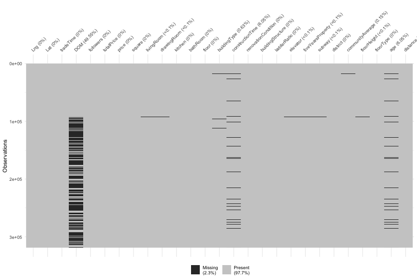
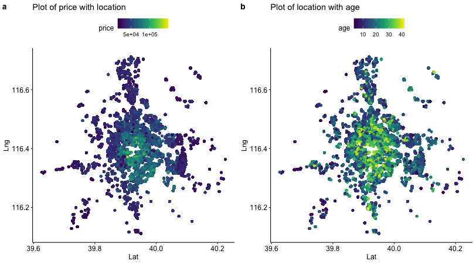
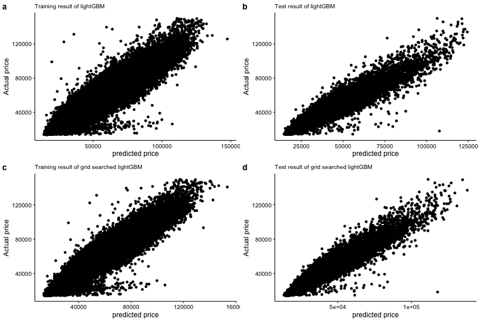
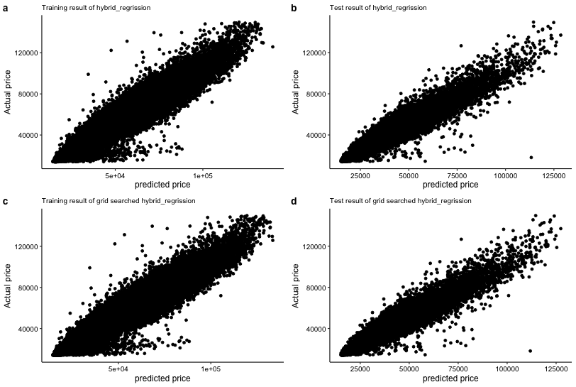

```{r setup, include=FALSE}
knitr::opts_chunk$set(echo = TRUE)
```


```{r load_library, warning = 0, message = 0}
library(tidyverse)
library(reshape2)
library(visdat)
library(lubridate)
library(ggplot2)
library(viridis)
library(psych)
library(caret)
library(groupdata2)
library(superml)
library(randomForest)
library(Metrics)
library(xgboost)
library(lightgbm)
library(ggpubr)
theme_set(theme_pubr())


list_to_df = function(missing, columns_name){
  df = data.frame(matrix(unlist(missing), nrow = length(missing), byrow = TRUE))
  names(df) = columns_name
  return(df)
}


outlier_removal = function(df, col_name){
  q = quantile(df[[col_name]], c(0.25, 0.75))
  q1 = q[[1]]
  q3 = q[[2]]
  iqr = q3 - q1
  # df = df %>% filter((!!as.symbol(col_name) < q3 + 1.5 * iqr) & (!!as.symbol(col_name) > q1 - 1.5 * iqr))
  return(c(col_name, q1 - 1.5*iqr, q3 + 1.5 * iqr))
}

RMSE = function(m, o){
  sqrt(mean((m - o)^2))
}
```

## Abstract

house Price Index(HPI) is commonly used to estimate the changes in house price. HPI is strongly related to some specific factors such as location, area, population, therefore, it is possible to predict the individual housing price to guide the house companies. There are many papers adopting traditional machine learning approaches. In this paper, multiple techniques in model implementation on regression will be be performed for House Price in Beijing Dataset.


## Introduction

Commonly, House Price Index (HPI) is used to measure price changes of residential housing in many countries, in recent years, machine learning has become a vital prediction approach and it has the capability of predicting different types of dataset. For the machine learning model predicting for HPI, most of the papers compared the models' performance but did not consider the combination of different machine learning models. In this paper, multiple decision tree models were performed to test the efficiency or accuracy of the models. And average ensemble will be performed also to neutral the bias and variation of models and stacked generalization approach, a machine learning ensemble technique is performed to optimize the predicted values. Finally, Root Mean Squared Logarithmic Error (RMSLE) is used as a standard score to evaluate the model


## data preprocess

“Housing Price in Beijing” is a dataset containing more than 300, 000 data with 26 variables representing housing
prices traded between 2009 and 2018. These variables, which served as features of the dataset, were then used to
predict the average price per square meter of each house.

Here is the detailed explanation for each features

url: the url which fetches the data (character)

id: the id of transaction (character)

Lng: and Lat coordinates. (numerical)

Cid: community id (numerical)

tradeTime: the time of transaction (character)

DOM: active days on market. (numerical)

followers: the number of people follow the transaction. (numerical)

totalPrice: the total price (numerical)

price: the average price by square (numerical)

square: the square of house (numerical)

livingRoom: the number of living room (character)

drawingRoom: the number of drawing room (character)

kitchen: the number of kitchen (numerical)

bathroom the number of bathroom (character)

floor: the type and height of the house. (character)

buildingType the type of building (numerical)

constructionTime: the time of construction (numerical)

renovationCondition: the condition of renovation. (numerical)

ladderRatio: the proportion between number of residents on the same floor and number of elevator of ladder. (numerical)

elevator have ( 1 ) or not have elevator( 0 ) (numerical)

fiveYearsProperty: if the owner have the property for less than 5 years (numerical)

### Load and clean data

First of all, I load and do some initial clean for the data. Since there are some missing value or meaningless value, I replace word nan as NA value and delete url, id and Cid which is neither meaningful for training nor developing new features. 


Then I turn the livingRoom, bathRoom, and constructionTime features into numeric and with as.numeric function, the unconverted cells will turn into NA value. And turn the tradeTime to datetime type and extract the year. 

And then split floor features into 2 different features, first part is floorType second part is floorHeight, unsplited or unconverted cells will turn into NA value. Since floorType contains are not very meaningful values, so I used LabelEncoder to transform it into categorical data. 

Then generate new feature age from 2019 - constructTime and turn it into numeric and distance is another feature that should be added which is the distance from the center of the city calculated from Lat and Lng


```{r load_data, warning = 0}
df = read.csv('./resources/house_price.csv', sep = ',', stringsAsFactors = FALSE, encoding = 'UTF-8')
df = replace(df, df=="nan", NA)
df = data.frame(df %>% dplyr::select(-url, -id, -Cid))
df$livingRoom = as.numeric(df$livingRoom)
df$bathRoom = as.numeric(df$bathRoom)
df$drawingRoom = as.numeric(df$drawingRoom)
df$district = as.factor(df$district)
df$constructionTime = as.numeric(df$constructionTime)
df$tradeTime = year(as.Date(df$tradeTime, format = "%Y-%m-%d"))
df[["floorHeight"]] = as.numeric(sapply(df$floor, function(x) strsplit(x,' ')[[1]][2]))
df[["floorType"]] = sapply(df$floor, function(x) strsplit(x,' ')[[1]][1])
lbl = LabelEncoder$new()
df$floorType = lbl$fit_transform(df$floorType)
df[['age']] = as.numeric(2019 - df$constructionTime)
df = as_tibble(df)
df = df %>% mutate(distance = sqrt((Lat - 39.9042)^2 + (Lng - 116.4074)^2)) %>%
  mutate(livingRoom = pmax(1, pmin(livingRoom, 4)))

```

### review missing value

Plot missing value using vis_miss function showing in figure 1, and based on the image, we can get the idea that DOM (Day on market) contains more than 50% of missing value, therefore I remove it and other features' missing values are not huge amounts, so I remove the rows if there are any missing values.

(All of figures use a lot of time to generate, so I just use generated plots to show the results to save some time)

```{r missing_value, message = 0}
# This is the code to generate thhis figure
png("test_image/figure_1.png", width = 812, height = 545)
vis_miss(df, warn_large_data = FALSE)
dev.off()
```



### outlier detected and removal

To remove the outlier, I used inter-Quartile Range(IQR) to detect the outlier:

x < Q1 - 1.5 * IQR OR Q3 + 1.5 * IQR < x

where Q1 = 25th percentiles and Q3 = 75th percentiles and IQR = Q3 - Q1

And it is not clear in the paper how to detect and which features are detected, I use "followers", "square", "age", "floorHeight", "distance", "ladderRatio", "communityAverage", "totalPrice" features to detect the outlier one by one and then remove it. 

And then turn these features into factor for further plot: "district", "buildingType", "renovationCondition", "buildingStructure", "elevator", "fiveYearsProperty", 'subway', "renovationCondition". 

Meanwhile, it makes no sense to purchase a house within 14000 dollars, so I remove the price that less than 14000 dollars.

In the paper, the final dataset contained 231962 rows but in my calculation it contains 231167 rows which is pretty similar.

```{r outlier_removal}
drop_columns = c("DOM", "floor", "constructionTime")
df = df[,!(names(df) %in% drop_columns)]
df = df %>% drop_na()
fact = c("district", "buildingType", "renovationCondition", "buildingStructure", "elevator",
         "fiveYearsProperty", 'subway', "renovationCondition")
for (i in fact){
  df[[i]] = as.factor(df[[i]]) 
}
num_factor = c("followers", "square", "age", "floorHeight", "distance", 
               "ladderRatio", "communityAverage", "totalPrice")
col_list = list()
for (i in 1:length(num_factor)){
  col_list[[i]] = outlier_removal(df, num_factor[[i]])
}
for (i in col_list){
  df = df %>% filter((!!as.symbol(i[[1]]) < as.numeric(i[[3]])) & 
                       (!!as.symbol(i[[1]]) > as.numeric(i[[2]])))
}
df = df %>% filter(price >= 14000)
count(df)[['n']]
```

### drop unnecessary columns and normalized target

There are several columns that are unnecessary: "DOM", "floor", "constructionTime", "totalPrice", "kitchen", "bathRoom", "drawingRoom", "totalPrice" so I drop them. The final features are 19 which is consistent with the paper

In the paper, they used RMSLE instead of RMSE besides showing in the image of histogram of the target, price (not show in the paper) is a right tail showing in figure 2a but with log1p (log(y+1)) transformation, the target is almost normal distribution showing in figure 2b. This is a better performance for target for all machine learning training. So used this transform, it is not necessary to use RMSLE as losing function in the training process, RMSE is enough. Besides, all the default loss function for models are not included RMSLE

```{r drop_columns_norm_target, message = 0}
drop_columns = c("DOM", "floor", "constructionTime", "totalPrice", "kitchen", "bathRoom", "drawingRoom", "totalPrice")
df = df[,!(names(df) %in% drop_columns)]
df$price_t = log1p(df$price)
# this is the code to generate plot
png('test_image/figure_2.png', width = 810, height = 320)
a = ggplot(df, aes(x = price)) + geom_histogram(binwidth = 30) + ggtitle("Histogram of price")
b = ggplot(df, aes(x = price_t)) + geom_histogram(binwidth = 0.02) + ggtitle("Histogram of log1p transformed price")
ggarrange(a, b, labels = c('a', 'b'), ncol = 2, nrow = 1)
length(names(df)) - 2
dev.off()

```


## Data analysis

Before building the model, we need to know the distribution of the dataset.

First, as the target of the dataset, I want to know whether it is location dependent, so I used Lat as x axis and Lng as y axis and the color is price. It is pretty clear that price is location dependent showing in the figure 3a. 

```{r analysis_plot, message = 0}
# the code to plot all the figures
png("./test_image/figure_3.png", width = 812, height = 450)
a = ggplot(df, aes(x = Lat, y = Lng, color = price)) + geom_point()+
    scale_color_viridis(option = "D") + ggtitle("Plot of price with location")
b = ggplot(df, aes(x = Lat, y = Lng, color = age)) + geom_point()+
   scale_color_viridis(option = "D") + ggtitle("Plot of location with age")
ggarrange(a, b, labels = c('a', 'b'), ncol = 2, nrow = 1)
dev.off()

png("./test_image/figure_4.png", width = 812, height = 545)
a = ggplot(df, aes(x = district, y=price)) +
  geom_boxplot()+ ggtitle("Plot of price with district")
b = ggplot(df, aes(x = buildingType, y=price)) +
  geom_boxplot()+ ggtitle("Plot of price with buildingType")
c = ggplot(df, aes(x = buildingType, y=square)) +
  geom_boxplot()+ ggtitle("Plot of square with buildingType")
ggarrange(a, ggarrange(b,c, ncol = 2, labels = c('b', 'c')), labels = 'a', nrow = 2)
dev.off()
```



Then, the age of house is also dependent in location, showing in the figure 3b


Then I want to know whether there is a relationship between price and districts, so I use a bar plot to plot different districts with prices, and the price is different between districts showing in figure 4a

Then I want to know whether there is a correlation between price or square with buildingType, so I use bar plot to plot different buildingType with price and square, the result showing int the figure 4b and figure 4c


## model selection

### scale and one hot encoded for features

For all numerical features, they are standardized, I don't think this step is necessary since only decision tree based model are performed, I will talk about this in the discussion. 

And for all dummy variable, one-hoe-encoded (dummy variable) are performed to make it work. This is only necessary for partial model, I will also discuss this in discussion. 

There are 51 variables in the dataset but in the paper they had 58, I think it is fine since they didn't show the detail about categorical features and I used these features as categorical features and I think it makes more sense.

Since there are 51 variables it is necessary to check about cumulative explained variance to check whether some of the variable has less variance so we can delete them. However, the curve is pretty smooth and almost converges around 30th showing in the figure 5. So we don't need to delete the features. This is suggested by the paper which is not correct, I will discuss this in the discussion.

```{r scale_dummy, message = 0}
num_factor = c("followers", "square", "age", "floorHeight", "distance", "ladderRatio", "communityAverage")
for (i in num_factor){
  df[[i]] = scale(df[[i]])
}
df = as.data.frame(cbind(df %>% select_if(is.numeric),
                         "district" = dummy.code(df$district),
                         "buildingType" = dummy.code(df$buildingType),
                         "renovationCondition" = dummy.code(df$renovationCondition),
                         "elevator" = dummy.code(df$elevator),
                         "subway" = dummy.code(df$subway),
                         "fiveYearsProperty" = dummy.code(df$fiveYearsProperty),
                         "floorType" = dummy.code(df$floorType),
                         "buildingStructure" = dummy.code(df$buildingStructure)))
pr = prcomp(df[,!(names(df) %in% c("price"))], center = TRUE, scale = TRUE)

cum_pr <- as.data.frame(cumsum(pr$sdev^2 / sum(pr$sdev^2)))
names(cum_pr) = c("cum_variance")
cum_pr$index = as.numeric(row.names(cum_pr))
# this is the code for PCA
png("test_image/figure_5.png", width = 812, height = 545)
ggplot(cum_pr, aes(x = index, y = cum_variance)) + geom_line() + xlab("number of components") +
  ylab("cumulative explained variance")
dev.off()

```


```{r columns_num}
length(names(df)) - 2

```


### build the model

And I will split the training and test dataset in a ratio of 4:1. This will give a better idea about whether it is over-fitting and most common and easiest way to train and test the model. 

Other validation method called cross-validation is used in grid search for hyper parameter.


```{r split_train}

df = fold(df, k = 5)
train = df[df$.folds != 5,names(df)[1:length(names(df))-1]]
train = train[,!(names(train) %in% c('price'))]
test = df[df$.folds == 5,names(df)[1:length(names(df))-1]]
test = test[,!(names(test) %in% c('price'))]

```


After this part, I use python code instead of R since the hyper parameter of R and python may not be same and for hybrid regression and stacked generalization, R doesn't have a common library to train, on the other hand python sklearn library has defined functions. So, I use python to train the model but visualize the data with R instead. 

The code is in test.py


```{r run_plot, message = 0}
# all the figures are ploted by this code

df_train = as_tibble(read.csv('./resources/train_result.csv'))
df_test = as_tibble(read.csv('./resources/test_result.csv'))
png("test_image/figure_6.png", width = 812, height = 545)
ele = element_text(size = 10)
a = ggplot(df_train, aes(y = target, x = Random_Forest)) + geom_point() +
  ggtitle("Training result of random forest") + xlab("predicted price") + ylab("Actual price") +
  theme(plot.title = ele, axis.text = ele)
b = ggplot(df_test, aes(y = target, x = Random_Forest)) + geom_point() +
  ggtitle("Test result of random forest") + xlab("predicted price") +
  ylab("Actual price") +  theme(plot.title = ele, axis.text = ele)
c = ggplot(df_train, aes(y = target, x = Random_Forest_grid_search)) + geom_point() +
  ggtitle("Training result of grid searched random forest") + xlab("predicted price") +
  ylab("Actual price") +  theme(plot.title = ele, axis.text = ele)
d = ggplot(df_test, aes(y = target, x = Random_Forest_grid_search)) + geom_point() +
  ggtitle("Test result of grid searched random forest") + xlab("predicted price") +
  ylab("Actual price") +  theme(plot.title = ele, axis.text = ele)
ggarrange(a,b,c,d, labels = c('a', 'b', 'c', 'd'), ncol = 2, nrow = 2)
dev.off()
png("test_image/figure_7.png", width = 812, height = 545)
a = ggplot(df_train, aes(y = target, x = lightGBM)) + geom_point() +
  ggtitle("Training result of lightGBM") + xlab("predicted price") + ylab("Actual price") +
  theme(plot.title = ele, axis.text = ele)
b = ggplot(df_test, aes(y = target, x = lightGBM)) + geom_point() +
  ggtitle("Test result of lightGBM") + xlab("predicted price") +
  ylab("Actual price") +  theme(plot.title = ele, axis.text = ele)
c = ggplot(df_train, aes(y = target, x = LightGBM_grid_search)) + geom_point() +
  ggtitle("Training result of grid searched lightGBM") + xlab("predicted price") +
  ylab("Actual price") +  theme(plot.title = ele, axis.text = ele)
d = ggplot(df_test, aes(y = target, x = LightGBM_grid_search)) + geom_point() +
  ggtitle("Test result of grid searched lightGBM") + xlab("predicted price") +
  ylab("Actual price") +  theme(plot.title = ele, axis.text = ele)
ggarrange(a,b,c,d, labels = c('a', 'b', 'c', 'd'), ncol = 2, nrow = 2)
dev.off()
png("test_image/figure_8.png", width = 812, height = 545)
a = ggplot(df_train, aes(y = target, x = xgboost)) + geom_point() +
  ggtitle("Training result of xgboost") + xlab("predicted price") + ylab("Actual price") +
  theme(plot.title = ele, axis.text = ele)
b = ggplot(df_test, aes(y = target, x = xgboost)) + geom_point() +
  ggtitle("Test result of xgboost") + xlab("predicted price") +
  ylab("Actual price") +  theme(plot.title = ele, axis.text = ele)
c = ggplot(df_train, aes(y = target, x = XGboost_grid_search)) + geom_point() +
  ggtitle("Training result of grid searched xgboost") + xlab("predicted price") +
  ylab("Actual price") +  theme(plot.title = ele, axis.text = ele)
d = ggplot(df_test, aes(y = target, x = XGboost_grid_search)) + geom_point() +
  ggtitle("Test result of grid searched xgboost") + xlab("predicted price") +
  ylab("Actual price") +  theme(plot.title = ele, axis.text = ele)
ggarrange(a,b,c,d, labels = c('a', 'b', 'c', 'd'), ncol = 2, nrow = 2)
dev.off()
png("test_image/figure_9.png", width = 812, height = 545)
a = ggplot(df_train, aes(y = target, x = hybrid_regrission)) + geom_point() +
  ggtitle("Training result of hybrid_regrission") + xlab("predicted price") + ylab("Actual price") +
  theme(plot.title = ele, axis.text = ele)
b = ggplot(df_test, aes(y = target, x = hybrid_regrission)) + geom_point() +
  ggtitle("Test result of hybrid_regrission") + xlab("predicted price") +
  ylab("Actual price") +  theme(plot.title = ele, axis.text = ele)
c = ggplot(df_train, aes(y = target, x = hybrid_regrission_grid_search)) + geom_point() +
  ggtitle("Training result of grid searched hybrid_regrission") + xlab("predicted price") +
  ylab("Actual price") +  theme(plot.title = ele, axis.text = ele)
d = ggplot(df_test, aes(y = target, x = hybrid_regrission_grid_search)) + geom_point() +
  ggtitle("Test result of grid searched hybrid_regrission") + xlab("predicted price") +
  ylab("Actual price") +  theme(plot.title = ele, axis.text = ele)
ggarrange(a,b,c,d, labels = c('a', 'b', 'c', 'd'), ncol = 2, nrow = 2)
dev.off()
png("test_image/figure_10.png", width = 812, height = 545)
a = ggplot(df_train, aes(y = target, x = stack_generation)) + geom_point() +
  ggtitle("Training result of stack_generation") + xlab("predicted price") + ylab("Actual price") +
  theme(plot.title = ele, axis.text = ele)
b = ggplot(df_test, aes(y = target, x = stack_generation)) + geom_point() +
  ggtitle("Test result of stack_generation") + xlab("predicted price") +
  ylab("Actual price") +  theme(plot.title = ele, axis.text = ele)
c = ggplot(df_train, aes(y = target, x = stack_generation_grid_search)) + geom_point() +
  ggtitle("Training result of grid searched stack_generation") + xlab("predicted price") +
  ylab("Actual price") +  theme(plot.title = ele, axis.text = ele)
d = ggplot(df_test, aes(y = target, x = stack_generation_grid_search)) + geom_point() +
  ggtitle("Test result of grid searched stack_generation") + xlab("predicted price") +
  ylab("Actual price") +  theme(plot.title = ele, axis.text = ele)
ggarrange(a,b,c,d, labels = c('a', 'b', 'c', 'd'), ncol = 2, nrow = 2)
dev.off()
```


### Random Forest

Random Forest is decision tree based ensemble model that combines the predictions of multiple decision trees to create more accurate final prediction. Random forest or bootstrap based method can combine low biased but high variances models to decrease the variances compared with gradient boost which can decrease the biased but cannot decrease the variances. "Random" in Random Forest is randomly selecting the features and data by bootstrap (randomly choose n samples from dataset with replacement)

In the paper, there are 2 parameters that need to be set: max_depth, min_samples_split

max_depth: the maximum depth of the tree, this is the most important hyper parameter to avoid over-fitting

min_samples_split: the minimum number of samples required to split an internal node. This is very important also to avoid over-fitting.


```{r rf}
# This is the code for random forest model training
# rf = randomForest(price_t ~ ., data = train, ntree = 900, maxnodes = 20, nodesize = 10)
# testing = df[,names(df)[1:length(names(df))-1]]
# testing = testing[,!(names(testing) %in% c('price', "price_t"))]
# predictions = predict(rf, newdata = testing)
# names(predictions)
# df_p = as.data.frame(cbind(df, predictions))
# names(df_p)[[length(names(df_p))]] = "rf_prediction"

# This is the code for visualization for python-code training result

df_r = as_tibble(read.csv('./resources/rmse_result.csv'))
df_r["test_rmsle_grid_search"] = 0.0
df_r["train_rmsle_grid_search"] = 0.0
df_r[1, "train_rmsle_grid_search"] = df_r[4, "train_rmsle"]
df_r[2, "train_rmsle_grid_search"] = df_r[5, "train_rmsle"]
df_r[3, "train_rmsle_grid_search"] = df_r[6, "train_rmsle"]
df_r[7, "train_rmsle_grid_search"] = df_r[8, "train_rmsle"]
df_r[9, "train_rmsle_grid_search"] = df_r[10, "train_rmsle"]
df_r[1, "test_rmsle_grid_search"] = df_r[4, "test_rmsle"]
df_r[2, "test_rmsle_grid_search"] = df_r[5, "test_rmsle"]
df_r[3, "test_rmsle_grid_search"] = df_r[6, "test_rmsle"]
df_r[7, "test_rmsle_grid_search"] = df_r[8, "test_rmsle"]
df_r[9, "test_rmsle_grid_search"] = df_r[10, "test_rmsle"]
df_r = df_r[c(1,2,3,7,9),]

df_r[1,]

```


### grid search for hyper parameter

Since the data is not exactly same compared with the paper result, it is a good idea to redo the model hyper parameter by grid search. In here, I use train dataset and sklearn GridSearchCV to find the best estimator. 

For Random Forest, I select max_depth and min_samples_split as params_range to search the best estimator.

The result of RF is showing in figure 6 plot with actual price and predicted price


## Extreme Gradient Boosting (XGBoost)

XGBoost is a scalable machine learning system for gradient boosting decision tree (GBDT), The scalability of XGBoost is due to several major systems and algorithmic optimization including a novel tree learning algorithm for handling sparse data and a theoretically justified weighted quantile sketch procedure enabling instance weight handling in approximate tree learning. And it suppose multiple loss functions.

However there are several disadvantages for this model: it cannot handle categorical features, and this is the reason why I transfer the categorical features into dummy variables, and it uses sort to select split node for features, this will decrease the performances speed.

XGBoost grows tree level-wise.

In the paper, multiple hyper parameter are modified:

learning_rate: Step size shrinkage used in update to prevents over-fitting. After each boosting step, we can directly get the weights of new features, and learning_rate shrinks the feature weights to make the boosting process more conservative.

n_estimators: Number of gradient boosted trees.

min_child_weight: Minimum sum of instance weight (hessian) needed in a child

subsample: Subsample ratio of the training instances to avoid overfitting

colsample_bytree: the subsample ratio of columns when constructing each tree to avoid overfitting

reg_lambda: L2 regularization term on weights. Increasing this value will make model more conservative.

reg_alpha: L1 regularization term on weights. Increasing this value will make model more conservative.

gamma: Minimum loss reduction required to make a further partition on a leaf node of the tree.

For grid search, I use learning_rate, n_estimators.


```{r xgboost}

# xgb_model = xgb.train(data = dtrain, params=params, nrounds = 2000, early_stopping_rounds = 50, 
#                       watchlist = list(train = dtrain, test = dtest))
# testing = df[,names(df)[1:length(names(df))-1]]
# testing = testing[,!(names(testing) %in% c('price', 'price_t'))]
# dpredict = xgb.DMatrix(data = as.matrix(testing))
# prediction = predict(xgb_model, dpredict)
# df_p = as.data.frame(cbind(df_p, prediction))
# names(df_p)[[length(names(df_p))]] = 'xgb_prediction'
# df_test = df_p[df_p$.folds == 5,]
# RMSE(df_p$price_t, df_p$xgb_prediction)
df_r[3,]

```

The XGBoost result is showing in figure 7


### Light Gradient Boosting Machine (LightGBM)

LightGBM is a gradient boosting framework that uses a tree-based learning algorithm. LightGBM has faster training
speed with lower memory usage compare to XGBoost because it uses histogram instead of sorting for each feature. And it support categorical features therefore, it is not necessary to generate dummy variables for this model.

LightGBM grows tree leaf-wise. This support lightGBM converges faster because likely, most of the entropy are dropped fast in the beginning several features and with carefully setup of num_leaves or max_depth, overfitting could be avoided.

In the paper, multiple hyper parameter are modified:

n_estimators: number of boosting iterations

learning_rate: shrinkage rate

num_leaves: max number of leaves in one tree

min_child_weight: minimal sum hessian in one leaf

colsample_bytree: LightGBM will randomly select a subset of features on each iteration (tree).

reg_lambda: L2 regularization

For grid search, I use learning_rate, n_estimators, num_leaves to search the best hyper parameters

```{r lgb}

# gb_train = lgb.Dataset(data = as.matrix(features), label = train$price_t)
# lgb_test = lgb.Dataset(data = as.matrix(t_features), label = test$price_t)
# params = list(learning_rate = 0.15, boosting_type = 'gbdt', objective = "regression",
#                metric = 'rmse', min_child_weight = 2, num_leaves = 36, 
#                colsample_bytree = 0.8, reg_lambda = 0.4)
# lgb_model = lgb.train(params = params, data = lgb_train, nrounds = 2000, 
#                       early_stopping_rounds = 50, eval = list(valid = lgb_test))
# prediction = predict(lgb_model, dpredict)
# df_p = as.data.frame(cbind(df_p, prediction))
# names(df_p)[[length(names(df_p))]] = 'lgb_prediction'
# df_test = df_p[df_p$.folds == 5,]
# RMSE(df_p$price_t, df_p$xgb_prediction)
df_r[2,]

```

The result plots in figure 8




### hybrid regression

Hybrid Regression Model is a model that includes two or more different regression models. 

A voting regressor which is same as hybrid regression is an ensemble meta-estimator that fits several base regressors, each on the whole dataset. Then it averages the individual predictions to form a final prediction.


The model consisted of 33% Random Forest 33% XGBoost and 33% LightGBM.

Since there are lots of features to optimize training time is too long, I use rf max_depth lightgbm n_estimators and num_leaves and xgb n_estimators.


```{r hybrid_regression}
df_r[4,]
```


The result is showing in figure 9




### Stacked Generalization

Stacked Generalization is a machine learning ensemble technique, The main idea of this method is to use the predictions of previous models as features for another model.


xgboost as a second stacking level, it is unoptimized, so only RF and lightGBM can be optimized.

```{r stack}
df_r[5,]
```

The result of stacked generalization is showing in figure 10


## Result and discussion

```{r final}

df_r
```

The final result is better than the result in paper, the reason is because I remove the outlier that the price is lower than 14000 which I think doesn't make any sense since it is impossible to purchase a house or apartment within 14000 dollars. Meanwhile, the mean idea for this paper is that ensemble different models together will increase the accuracy. My result can partially support this result.

During the data process, it is very hard to follow the paper to repeat since the whole process is ambiguous and even some of them are make no sense: 

First, it is not a good idea to drop the whole row with missing value, we could use different methods to fill in the missing value, one of the way is using KNN to fill by location since the the neighborhood would have very similar properties.

Second, some other features may add to the dataset. 

Third the feature selection should also be performed using different way such as step-wise to simplify the dataset and increase the accuracy. 

Last, the outlier detecting and removing is very rough, just using IQR is not a very good idea, I think my idea of removing the lower than 14000 price maybe better.

For the model selection, standardized for numerical values are meaningless since there are only using decision tree based models in this paper. Decision tree does not need standardized data because the key of the models is spited value by entropy or other information. And one-hot-encoded is also not necessary since lightGBM can handle categorical data and it has its own datatype to handle especially for large dataset. 

For evaluation function, using Root Mean Squared Logarithmic Error may be a good way, but there is no built-in loss function in these models so I don't know how they train the model, but one of the simple way is just use log1p to transform the target. 

There is a mistake writing in the Random Forest part: RandomForestClassifier is not class for regression training, it is for classification training.

In the random forest, it is very easy to get an idea that the train error is significantly smaller than test error, therefore random forest get a strong overfitting, and it is very hard to say the performance since the dataset is too small and rf can decrease the variance but not bias.

For xgboost, there is a mistake that they didn't tune depth or max_leaves because these are the most important hyper parameter for overfitting instead of other hyper parameter and it will influence the model significantly, and n_estimators is not necessary to be tuning since we could use early stopping to limit the iteration with a very large n_estimators. This mistake is also happened to LightGBM.

Hybrid regression can ensemble different models to be a strong learner. And based on my result, it increases the accuracy but may not be better than rf. It is possible that I used very small amount of parameters and parameter ranges for grid search, this also happened in stack generation, with larger training time, with larger amount of parameter and ranges, I think this will gives a better result.  

For parameter tuning, I suggests to use Bayesian optimization instead of grid search because this can use prior possibility to adjust the direction for tuning, it will give a better result with very limited rounds. 

And we may try different metric such as MAE to train the model it may also help the results. 

And there are other decision tree model called CatBoost which generate balanced decision trees with small amount of parameters. This model is much easier to do the hyper parameter tuning. 

And it is also a good idea to try to use K-fold cross validation to generate the model, it will be much helpful for the accuracy since it will generate k models and similarly with hybrid regression ensemble them together.

The conclusion in this paper is that decision tree based model performs well in house price prediction and with ensemble by hybrid regression or stack generalization, the accuracy will be increased.

This conclusion is not supportive since the dataset is too small and the overfitting can be always happened.

